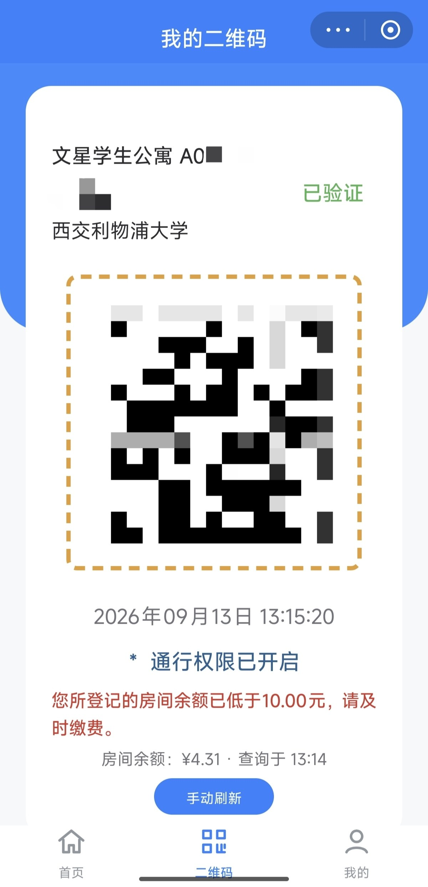

# 慧湖通门禁 (HuiHuTong Gate)

西交利物浦大学（XJTLU）宿舍与校园门禁的极简原生 Android 客户端。

秒级冷启动、下拉控制中心一键拉起、出码清脆震动反馈，彻底告别臃肿卡顿的微信官方小程序，过闸快人一步。

[](https://github.com/Oooo00o0O/HuiHuTong/releases/latest)
[](LICENSE)
[](https://developer.android.com)
[](https://github.com/Oooo00o0O/HuiHuTong/releases)

<p align="center">
  
</p>

> [!IMPORTANT]
> 本项目为开源第三方客户端，非西交利物浦大学或“慧湖通”官方出品。门禁属于安全敏感场景，所有凭据仅保存在手机本地，直接与官方服务通信，请仅使用你本人合法拥有的门禁账号。

---

## 核心亮点

- ⚡ **极致轻量，秒开即用**：体积不足 1 MB，没有任何臃肿的跨平台框架，原生纯代码渲染，冷启动毫秒级。
- 🎛️ **下拉控制中心磁贴（Quick Settings）**：支持 Android 原生快捷开关，在任何 App 或锁屏状态下，下拉屏幕点一下磁贴秒出码，无需回到桌面找图标。
- 📳 **触觉微震动反馈**：
  - 二维码首次就绪 / 手动刷新成功：手心清脆一震（`Confirm` 触感），走路盲操无需死盯屏幕；
  - 弱网 / 阻断性报错：顿挫双震警示（`Reject` 触感），避免未出码直接撞闸；
  - 每 10 秒静默轮询更新：完全静音，零打扰。
- 💡 **屏幕亮度自适应锁定**：进入前台自动拉满 100% 亮度便于闸机光学识别；切后台或下拉状态栏自动恢复系统原有亮度。
- 🔋 **房间电费余额**：可选显示对应宿舍房间的实时电费余额及低电预警。
- 🛡️ **绝对私密安全**：零云端后台、零埋点分析，Open ID 等凭据仅存放在设备私有沙盒存储内。

---

## 下载安装

前往 [GitHub Releases 页面](https://github.com/Oooo00o0O/HuiHuTong/releases/latest)，下载最新的 `HuiHuTong-Gate.apk` 安装即可。

*注：项目已配置永久固化签名，后续有新版本时直接下载覆盖安装即可，无需卸载，配置参数不会丢失。*

---

## 3 分钟小白指南：如何获取你的 Open ID？

由于微信体系的机制，每个用户在“慧湖通”小程序中都有一个专属的唯一身份标识码（`Open ID`，一串以字母 `o` 开头的 28 位字符串）。
**只需在电脑上花 2 分钟抓取一次并填入，后续永久生效。**

### 推荐方案：电脑端提取（Windows / macOS，最简单，免任何权限折腾）

电脑端微信运行在 Chromium 内核中，走系统标准网络代理，是获取 Open ID 最不易出错的方式。

1. **下载抓包工具**：
   - 推荐使用免费的 **Reqable**（[官网下载](https://reqable.com/)，有全中文界面，轻量且好用）。
2. **初始化证书**：
   - 打开 Reqable，点击顶部的「启动调试」或证书安装提示，按指引点击「一键安装到系统根证书」。
3. **打开微信小程序**：
   - 在电脑端打开「微信」并登录；
   - 点击打开「慧湖通」小程序，进入「门禁二维码」页面。
4. **获取 Open ID**：
   - 回到 Reqable，在抓到的网络请求列表中搜索关键词 `215123`；
   - 找到类似 `https://api.215123.cn/web-app/auth/certificateLogin` 的请求；
   - 点击该请求，在 URL 参数（Query）或响应体中可以看到 `openId`（例如 `oUpwt...` 这一串字符）；
   - 将这串值复制出来，填入本应用的 Open ID 输入框并保存即可！

---

### 备用方案：iPhone 用户提取（iOS，无需电脑）

如果你或你的室友使用的是 iPhone，可以通过苹果商店免费工具快速获取：

1. 在 App Store 搜索并安装 **Stream**（免费网络抓包工具）。
2. 打开 Stream，点击「开始抓包」（首次会提示在 iPhone「设置 -> 通用 -> 关于本机 -> 证书信任设置」中信任 Stream 根证书）。
3. 打开微信，进入「慧湖通」小程序并展示门禁二维码。
4. 回到 Stream 点击「停止抓包」，进入「抓包历史」搜索 `215123`。
5. 点开对应请求，复制里面的 `openId` 参数。

---

### 可选：如何获取房间电费编号？

如需在门禁码下方顺带显示宿舍电费：
- 在上述同一个抓包请求（或房间信息接口）中，可以一并看到 `apartmentId` 和 `roomId`（均为大于 0 的数字编号）；
- 在本应用「设置」弹窗的“房间余额”一栏中分别填入这两个数字保存即可。

---

## 进阶技巧：启用下拉控制中心一秒刷码

安装并配置完成后，强烈推荐将它添加到手机下拉快捷面板中：

- **方式一（应用内一键添加，推荐）**：
  打开应用，点击右上角胶囊按钮进入「设置」，点击最下方的 **【添加门禁到控制中心】**，在系统弹窗中点击“添加”即可（支持 Android 13+ 及小米澎湃OS / MIUI）。
- **方式二（系统控制中心手动添加）**：
  从手机屏幕右上角向下拉出控制中心，点击右上角「编辑（铅笔图标 ✏️）」，在下方的“未添加的开关”中找到 **“慧湖通门禁”**，点击加号将其拖动到常用开关栏。

之后过闸时，无需解锁找图标，手指向下一滑点一下，二维码即刻呈现。

---

## 本地构建

如果你希望自行从源代码构建：

```bash
git clone https://github.com/Oooo00o0O/HuiHuTong.git
cd HuiHuTong/HuihutongGate

# Windows
.\gradlew.bat assembleRelease

# Linux / macOS
chmod +x gradlew
./gradlew assembleRelease
```

构建结果位于：`app/build/outputs/apk/release/`

本项目配置了完整的 GitHub Actions CI/CD，打上 `v*` 格式的 tag 推送即可在云端全自动构建并发布签名安装包。

---

## 许可证

本项目依据 [GNU General Public License v3.0](LICENSE) 开源。

内置二维码算法改编自 Project Nayuki's QR Code generator（采用 MIT 许可，完整声明详见 [THIRD_PARTY_NOTICES.md](THIRD_PARTY_NOTICES.md)）。
